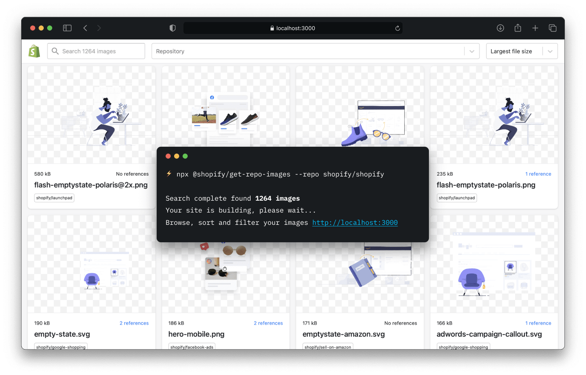

<p align="center">
  
</p>

<p align="center">
  <a href="https://github.com/Shopify/get-repo-images/actions/workflows/ci.yml">
    
  </a>
</p>

# get-repo-images

- ⚡️ An extremely fast repository crawler to find images across multiple repos
- 🌌 Find where the images are referenced in code... or not!
- 💾 Save the results to a JSON file
- 🌏 Generate a Next.js website to browse, sort and filter images
- 🪆 Sort by the file size, date created and number of references

As Shopify has scaled, our usage of illustrations in code has become fragmented across 6000+ repositories. We recently updated our illustration style and finding the illustrations, prioritising them, removing or updating them across our codebase was a challenge. We hope that `get-repo-images` will be useful for anyone maintaining images at scale.

| Status | Owner | Help |
| --- | --- | --- |
| Experimental | @polaris-team | [New issue](https://github.com/Shopify/get-repo-images/issues/new) |

## How to use

Start a website at at [http://localhost:3000](http://localhost:3000) to browse, sort and filter images from `alex-page/alexpage.com.au` 

```bash
$ npx get-repo-images -repo alex-page/alexpage.com.au
```

Create the files for a Next.js website into the `./repo-images-site` directory

```bash
$ npx get-repo-images -build -repo alex-page/alexpage.com.au
```

> Note: If you want to run the website you can run `cd repo-images-site && npm i && npm run dev`

Generate a JSON file with results to `./images.json`

```bash
$ npx get-repo-images -json -repo alex-page/alexpage.com.au
```

**Private repositories**

Add a [personal access token](https://github.com/settings/tokens/new?description=get-repo-images&scopes=repo) for private repositories. Replace `TOKEN` with your token.

```shell
$ get-repo-images watch -repo alex-page/alexpage.com.au -token TOKEN
```

**Advanced usage**

To get the images from multiple repositories, specific image extensions, minimum image sizes you can add more options to the `repos.config.json`:

```shell
$ get-repo-images watch -settings get-repo-images.json
```

```json
// get-repo-images.json
{
  "repos": [
    {
      "repo": "shopify/android",
      "minSize": 1000,
      "extensions": ["webp"],
      "usageMatchers": ["drawable"],
      "usageNoExtension": true
    },
    {"repo": "alex-page/harmonograph.art"},
  ]
}
```

## Contribute

We welcome contributions to this repo, both in the content and the codebase, and are happy to help! Have a feature request or found a bug? Submit a [new issue](https://github.com/Shopify/get-repo-images/issues/new).

**Release a new version**

Update the `package.json` file to the next [semantic version](https://semver.org). Push the changes to GitHub and then [create a release](https://github.com/Shopify/get-repo-images/releases/new?target=main).

## Technical details

get-repo-images is built using the following technologies:

- go, a programming language https://golang.org/
- go-git, git implementation for go https://github.com/go-git/go-git
- Next.js, a react framework https://nextjs.org
